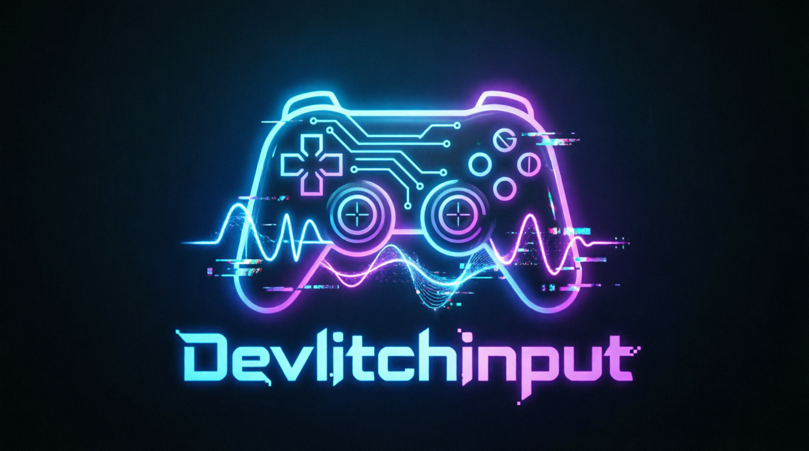

# DevlitchInput

> A lightweight SDL3-based virtual input bridge for Steam Remote Play/ Steam Link controllers.

---

## 📌 Overview

**DevlitchInput** is a Windows tool that bridges one or more controllers received via Steam Remote Play into virtual Xbox gamepads, allowing them to work seamlessly in non-Steam games.

It runs entirely on the host machine (the PC running the game) and converts incoming remote controller input into standard XInput devices using ViGEm.

> ⚠️ Note: This tool runs exclusively on the host machine and does not require installation on the client device.

---

## 🎯 Problem It Solves

Steam Remote Play controllers are often:

- Not visible to non-Steam games
- Not recognized as native gamepad devices

**DevlitchInput fixes this by exposing them as real virtual gamepads at system level.**

---

## ⚙️ Features

- SDL3-based controller detection
- System tray interface for control
- Enable/disable controllers per device
- Virtual Xbox 360 controller output (ViGEm)
- Hot-plug support (plug & play)
- Lightweight and low-latency design
- Supports multiple controllers simultaneously
- Rumble/Vibration forwarding

---

## 🖥️ Requirements

- Windows 10 / 11
- ViGEmBus Driver

---

## 📦 Installation
1. Install [ViGEmBus Driver](https://github.com/nefarius/ViGEmBus/releases/latest)
2. Download [latest release](https://github.com/devlitch/DevlitchInput/releases/latest)
3. Add `DevlitchInput.exe` to Steam as a **Non-Steam Game**
4. Launch `DevlitchInput.exe` through Steam, otherwise remote controllers will not be detected.
4. Select controllers from system tray

---

## 🚀 How It Works

1. SDL3 detects connected controllers
2. User selects controllers from system tray menu
3. Selected controllers are bridged
4. Input is forwarded to ViGEm virtual Xbox controller
5. Any game sees it as a normal Xbox gamepad

---

## 🧠 Future Plans

- UI overlay version
- Improved controller identification
- Virtual Playstation controller output
- Advanced input mapping system
- Per-game profiles
- Linux/macOS support