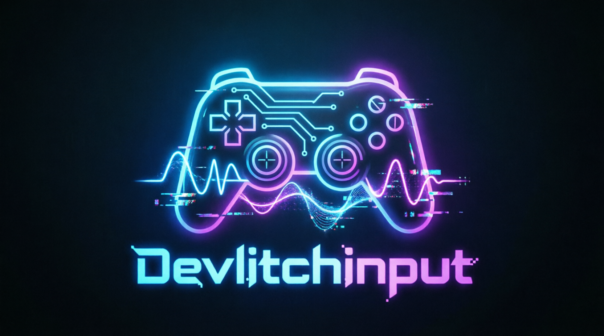
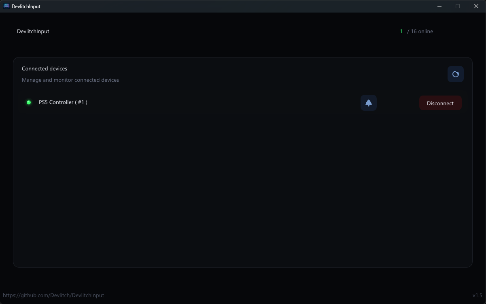

# DevlitchInput

> A lightweight virtual input bridge for Steam Remote Play / Steam Link controllers.

---

## 📌 Overview

**DevlitchInput** is a Windows tool that bridges one or more controllers received via Steam Remote Play into virtual Xbox gamepads, allowing them to work seamlessly in non-Steam games.

It runs entirely on the host machine (the PC running the game) and converts incoming remote controller input into standard XInput devices using ViGEm.

DevlitchInput handles Steam integration and controller management automatically, allowing users to connect their controllers directly from the UI.

> ⚠️ Note: This tool runs exclusively on the host machine and does not require installation on the client device.
```
Steam Remote Play
       │
       ▼
     sp.exe (DevlitchInput_steam_part)
       │
      SDL3
       │
       ▼
DevlitchInput Backend
       │
       ▼
     ViGEm
       │
       ▼
Virtual Xbox 360 Controller
       │
       ▼
      Game
```
---



---

## 🎯 Problem It Solves

Steam Remote Play controllers are often:

- Not visible to non-Steam games
- Not recognized as native gamepad devices

**DevlitchInput solves this by exposing them to Windows as virtual Xbox 360/XInput controllers at the system level.**

---

## ⚙️ Features

- UI interface for controller management
- Controller identification via vibration/ping button
- Enable/disable controllers per device
- Virtual Xbox 360 controller output (ViGEm)
- Hot-plug support (plug & play)
- Lightweight and low-latency design
- Supports multiple controllers simultaneously
- Rumble/Vibration forwarding

---

## 🖥️ Requirements

- Windows 10 / 11
- [ViGEmBus Driver](https://github.com/nefarius/ViGEmBus/releases/latest)

---

## 📦 Installation

1. Install [ViGEmBus Driver](https://github.com/nefarius/ViGEmBus/releases/latest)
2. Download the [latest release](https://github.com/devlitch/DevlitchInput/releases/latest)

Choose one of the following setup methods:

### 🔧 Manual Installation
> No Steam restart required.

1. Add `sp.exe` to Steam as a **Non-Steam Game**
2. In Steam, open `sp.exe` Properties → Controller → set **Override for DevlitchInput_SP** to **Disable Steam Input**
3. Run `DevlitchInput.exe`
4. Select the controllers you want to connect from the UI
5. Have fun

### ⚡ Automatic Installation
> **Recommended.** Requires a Steam restart.

1. Run `DevlitchInput.exe`
2. DevlitchInput will automatically configure `sp.exe`
3. Select the controllers you want to connect from the UI
4. Have fun

---

## 🚀 How It Works

1. `sp.exe` detects controllers received from Steam Remote Play via SDL3
2. DevlitchInput UI communicates with the backend locally
3. User identifies controllers using Ping and connects or disconnects them
4. Connected controllers are bridged to virtual Xbox 360 controllers through ViGEm
5. Games see them as standard XInput controllers

## 🔒 What It Can Access

> **No internet connection required. No data is shared.**

1. `Steam/config/loginusers.vdf` — Used to identify and select the Steam user to install for (username and account ID). **Read only**
2. `Steam/userdata/{YourSteamID}/config/shortcuts.vdf` — Used to add `sp.exe` to Steam. **Read/write, with automatic backup**
3. `Steam/userdata/{YourSteamID}/config/localconfig.vdf` — Used to disable Steam Input for `sp.exe`. **Read/write, with automatic backup**

DevlitchInput only accesses these files locally and does not upload or transmit their contents.

## 💾 What It Saves

1. `accountId` — Used to automatically select the previously configured user on the next run.
2. `SteamFolder`
3. `Username` — Stored only to display/identify the selected Steam user.

All of this information is stored in `Config.json` in the same folder as the program.

---

## 🧠 Future Plans
- Switch user button [For now, delete `Config.json` to switch users]
- System Tray with ability to minimize the program into it
- Virtual Playstation controller output
- Advanced input mapping system
- Per-game profiles
- Linux/macOS support

---

## 🛠️ Building

### 🖥️ Requirements

- SDL3@3.4.16
- SDL3_image@3.4.4
- ValveFileVDF@1.1.1
- nlohmann/json@3.12.0
- asio@1.38.2
- imgui@1.92.8 [Already included in the project]

1. Clone the repository
2. Install the required dependencies
3. Open `DevlitchInput.slnx` in Visual Studio 2026
4. Build the project

## 📄 License

DevlitchInput is distributed under the DevlitchInput License, a custom source-available license.

The license permits viewing, inspecting, using, and modifying the software for personal, educational, research, and other non-commercial purposes, subject to the terms of the license.

Commercial use, commercial redistribution, or incorporation into a commercial product or service requires prior written permission from the copyright holder.

See the full license in [`LICENSE`](LICENSE.md).

Copyright © 2026 Devlitch. All rights reserved.